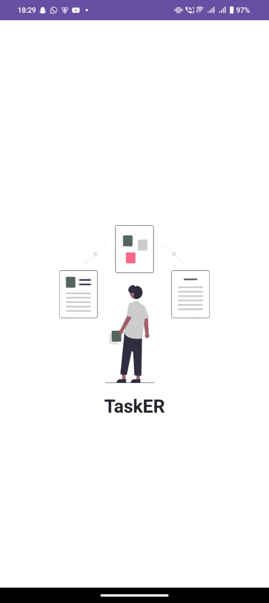
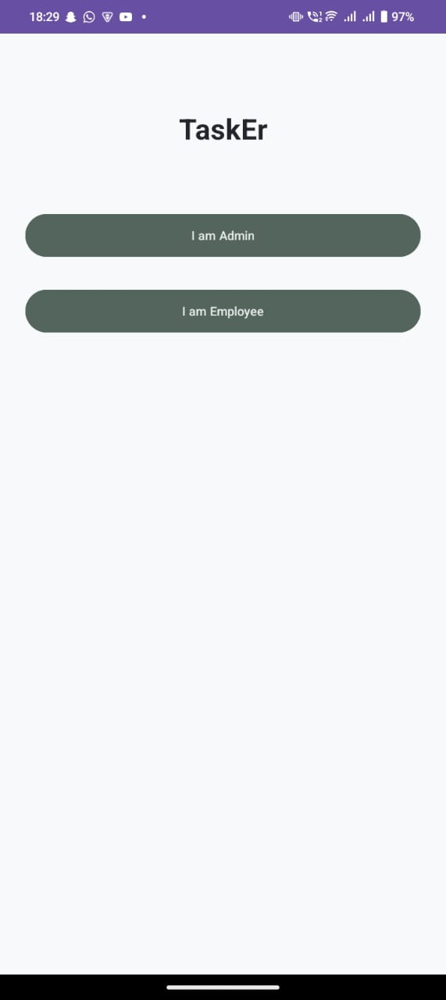
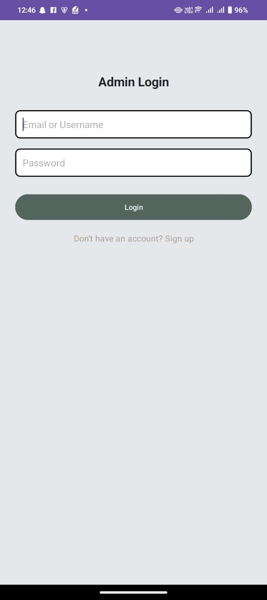
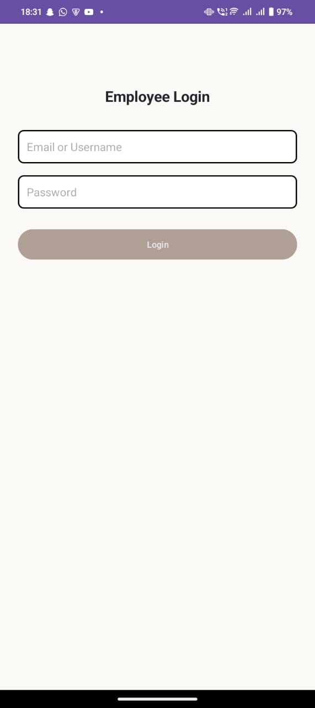
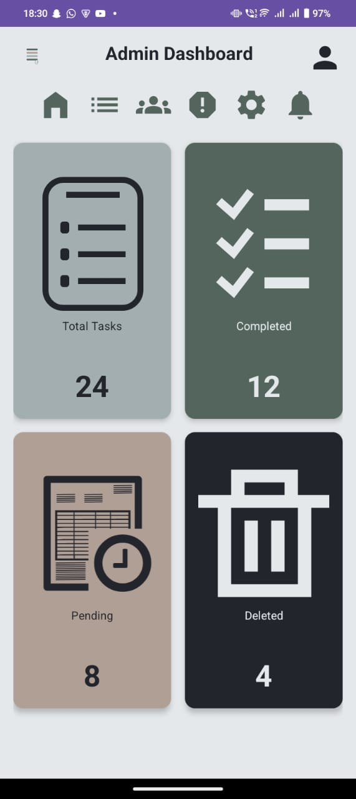
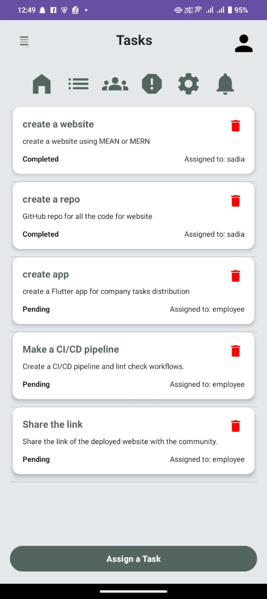
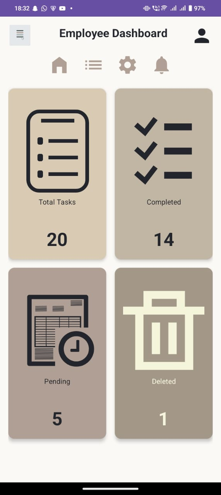
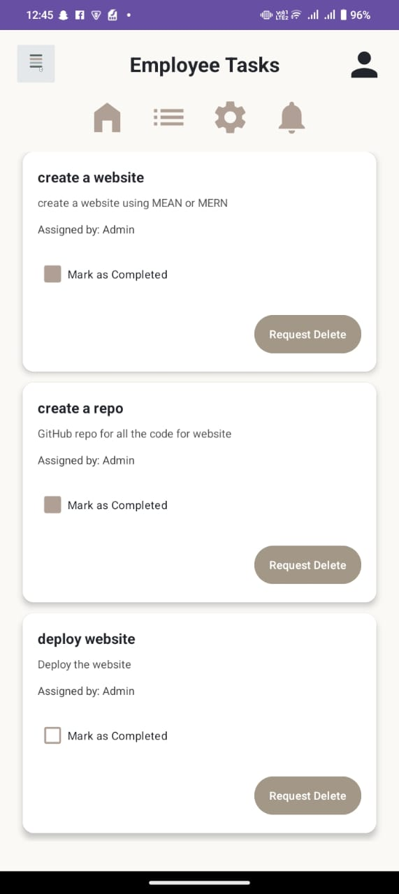
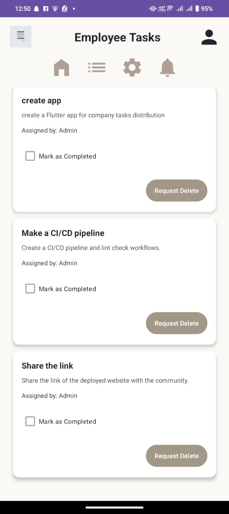
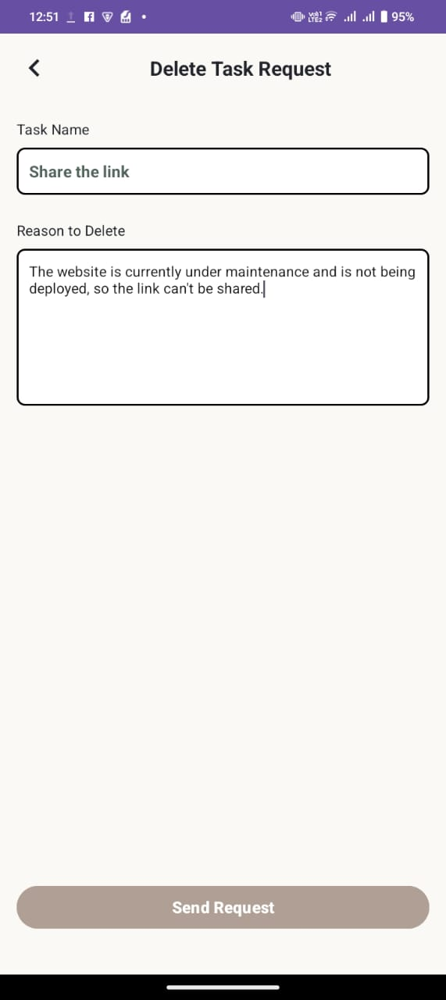

# TaskMaster - Android Application

**TaskMaster** is an Android application that simplifies task management between admins and employees. It allows the admin to assign tasks to employees and track their progress, while employees can view, update, and request deletion of tasks.

---

## 🚀 Splash & First Screen

### 🔹 Splash Screen  
The app launches with a branded splash screen.  

### 🔹 First Screen  
Users are taken to a screen where they can choose to log in as **Admin** or **Employee**.  

---

## 🔐 Login Screens

### 🔸 Admin Login  
Admins can securely log in to access their dashboard and task control panel.  

### 🔸 Employee Login  
Employees log in to view and manage their assigned tasks.  

---

## 📱 Features

### 👨‍💼 Admin Side

- Assign new tasks to employees  
- Delete existing tasks  
- Add/register new employees  
- View the status of all tasks  

#### Admin Screens:

**Dashboard**  

**Tasks**  
Click on a task to view its full details and assigned employee info  

**Employees**  

**Notifications**  

---

### 👩‍💼 Employee Side

- View tasks assigned by the admin  
- Update the status of tasks (e.g., In Progress, Completed)  
- Send delete requests for specific tasks  

#### Employee Screens:

**Dashboard**  

**Tasks**  
View task details, status, and delete request option  

  

**Request Delete Task**  
Allows employees to submit a reason for requesting task deletion  

**Profile**  
View and manage employee profile  
*(Add image if available)*

---

## 🚀 Tech Stack

- Kotlin  
- XML  
- Firebase Authentication  
- Firebase Realtime Database  
- Data Binding  
- RecyclerView (for list loading)

---
